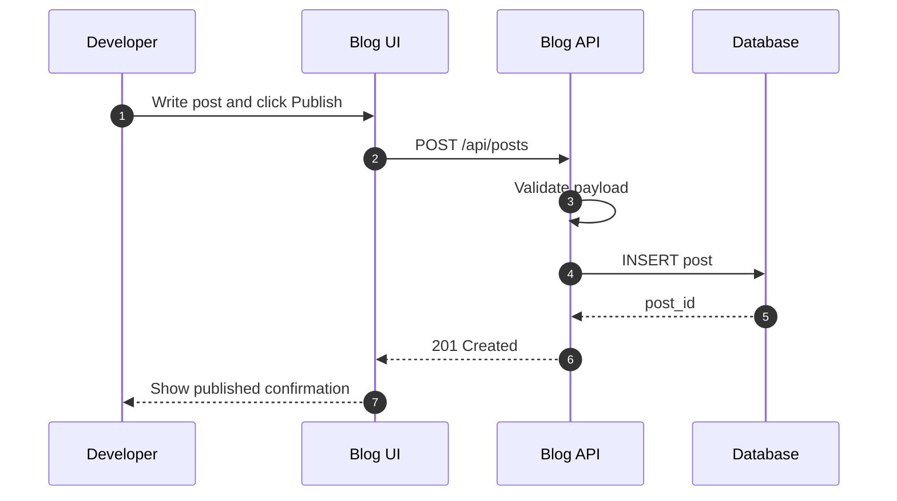
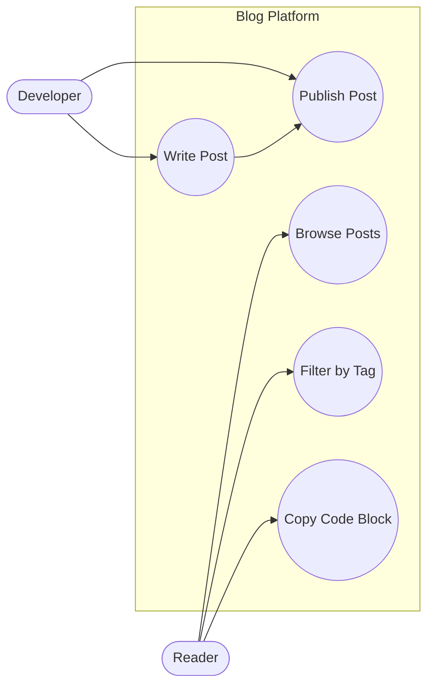

+++
title = 'Programming Utilities Demo Post'
date = 2026-02-23
draft = false
tags = ['programming', 'hugo', 'utilities']
summary = 'Demo article to validate copy code, TOC, back-to-top, tags, and previous/next navigation.'
+++


This post is intentionally long so you can test every utility feature in this template.

You should be able to verify:

- `Copy` buttons on code blocks
- `On This Page` table of contents
- `Back to top` button after scrolling
- Tag pills and post metadata
- Previous/next post navigation at the bottom

## 1. Problem Framing

When I start a programming task, I try to reduce ambiguity first.
A practical way is to write a short problem statement with one input example and one expected output example.
This sounds simple, but it helps prevent wasted implementation time because the acceptance rule is visible.
For small features, one paragraph is enough.
For bigger features, I create a short checklist of behavior, non-goals, and constraints.

The goal is not paperwork.
The goal is to make decisions quickly once coding starts.
If we know what “done” means, implementation gets faster and reviews become cleaner.

## 2. Baseline Command-Line Loop

A basic inner loop for CLI-oriented development:

```bash
# 1) run tests quickly
npm test

# 2) run lint checks
npm run lint

# 3) run local app
npm run dev
```

Small loops beat perfect plans.
If the loop is short, feedback is frequent, and bugs are found early.

## 3. Example: Structured Error Handling

Below is a tiny Go example showing explicit errors.

```go
package main

import (
    "errors"
    "fmt"
)

func divide(a, b float64) (float64, error) {
    if b == 0 {
        return 0, errors.New("division by zero")
    }
    return a / b, nil
}

func main() {
    out, err := divide(10, 2)
    if err != nil {
        fmt.Println("error:", err)
        return
    }
    fmt.Println("result:", out)
}
```

In production code, I also include context in error messages and keep side effects close to boundaries.

## 4. Example: Data Validation Rule

A JavaScript validation snippet:

```js
function validateUser(input) {
  const errors = [];

  if (!input.email || !input.email.includes('@')) {
    errors.push('email is invalid');
  }

  if (!Number.isInteger(input.age) || input.age < 13) {
    errors.push('age must be an integer >= 13');
  }

  return {
    ok: errors.length === 0,
    errors,
  };
}
```

For APIs, I usually return machine-readable codes and human-readable messages separately.

## 5. Sequence Diagram: Publish Flow



## 6. Use Case Diagram: Blog Features



## 7. Performance Notes

Before optimizing, measure first.
Common improvements often include reducing unnecessary network calls, batching DB operations, and caching expensive computations.
For frontend work, payload size and hydration behavior are typical hotspots.

A small win repeated many times can produce a large user impact.
That is why I prioritize removing obvious waste before introducing advanced complexity.

## 8. Testing Strategy

I prefer a layered approach:

1. Unit tests for pure logic
2. Integration tests for boundaries (DB/API/queue)
3. End-to-end checks for user-critical flows

This balance catches regressions without creating a brittle test suite.

## 9. Release Checklist

- Feature flag or guarded rollout when risk is high
- Migration strategy for schema changes
- Observability hooks (logs/metrics/traces)
- Rollback plan written before deployment

Fast shipping is good.
Safe shipping is better.

## 10. Closing Notes

If this page behaves correctly, your utility feature set is working.
Scroll up/down, test `Copy`, inspect the TOC links, and use previous/next links at the bottom.

If anything feels off, we can fine-tune spacing, button size, or utility placement.
